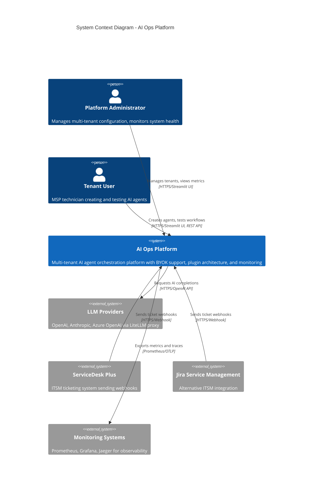
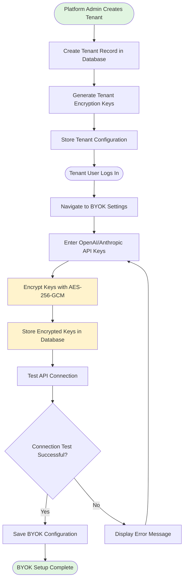
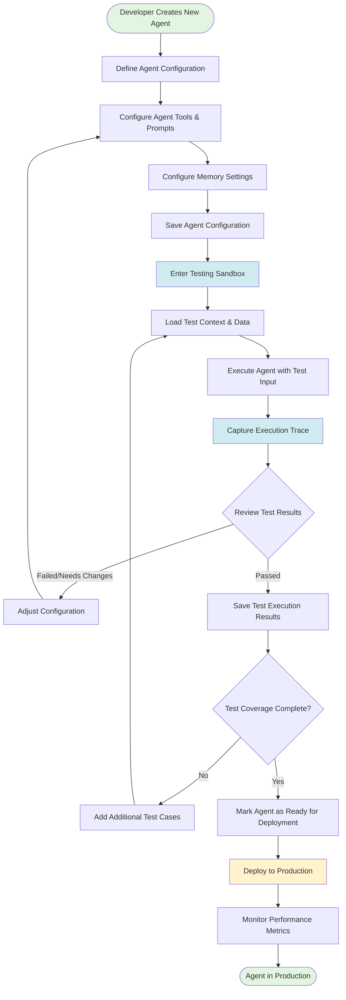
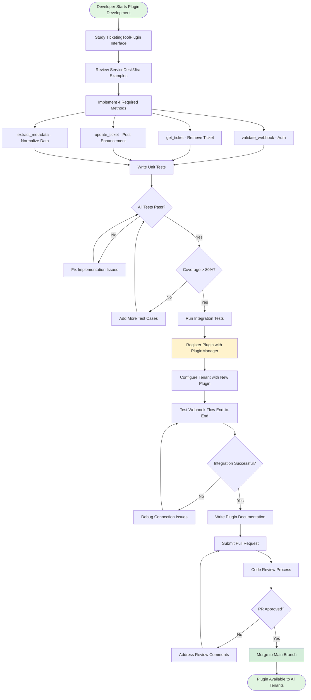

# AI Ops Platform - Technical Overview

**Document Version:** 1.0
**Last Updated:** 2025-11-07
**Purpose:** Technical presentation document for team onboarding

---

## Table of Contents

1. [What It Is - System Context Diagram](#1-what-it-is---system-context-diagram)
2. [How It Works - User Journey Flows](#2-how-it-works---user-journey-flows)
3. [What It's Built With - Technology Stack](#3-what-its-built-with---technology-stack)

---

## 1. What It Is - System Context Diagram

The AI Ops Platform is a **multi-tenant AI enhancement platform** designed for MSP (Managed Service Provider) technicians. It receives webhook requests from ticketing systems, enriches tickets with AI-powered context, and returns enhanced information to improve support workflows.

### Key External Actors

**Users:**
- **Platform Administrators** - Manage multi-tenant infrastructure, configure BYOK keys, monitor system health
- **Tenant Users** - MSP technicians who create, test, and deploy AI agents for ticket enhancement

**External Systems:**
- **LLM Providers** - OpenAI, Anthropic, Azure OpenAI (unified via LiteLLM proxy with automatic fallbacks)
- **ITSM Systems** - ServiceDesk Plus, Jira Service Management (extensible plugin architecture)
- **Monitoring Stack** - Prometheus (metrics), Grafana (dashboards), Jaeger (distributed tracing)

### System Boundary

The AI Ops Platform provides:
- **Multi-tenant isolation** with row-level security and encrypted credential storage
- **BYOK (Bring Your Own Key)** for tenant-managed API keys with AES-256 encryption
- **Agent lifecycle management** from creation → testing → deployment
- **Plugin architecture** for extensible ITSM integrations
- **Comprehensive observability** with metrics, dashboards, alerts, and distributed tracing

---

## 2. How It Works - User Journey Flows

### Journey 1: Tenant Onboarding & BYOK Setup

This flow shows how a new tenant is onboarded and configures their own API keys securely.

**Security Highlights:**
- AES-256-GCM encryption for all API keys
- Tenant-specific encryption keys stored in secure key management
- Row-level security ensures tenant isolation
- API keys never stored in plaintext

---

### Journey 2: Agent Development Lifecycle

This flow demonstrates the complete lifecycle from creating an agent to deploying it in production.

**Key Features:**
- **Isolated Testing Sandbox** prevents production impact during development
- **Execution Tracing** captures full agent execution flow for debugging
- **Test Coverage Tracking** ensures thorough validation before deployment
- **Performance Monitoring** tracks agent effectiveness in production

---

### Journey 3: Plugin Integration for New ITSM Tool

This flow shows how to extend the platform with a new ticketing system integration.

**Extensibility Benefits:**
- Standard interface ensures consistent behavior across plugins
- Independent testing prevents breaking existing integrations
- Plugin manager handles dynamic loading and routing
- Comprehensive documentation accelerates development

---

## 3. What It's Built With - Technology Stack

### Frontend Layer

| Technology | Version | Purpose |
|------------|---------|---------|
| **Streamlit** | 1.44.0+ | Admin UI for operations management, tenant configuration, metrics dashboards |
| **Pandas** | 2.1.0+ | Data manipulation for analytics and reporting |
| **Plotly** | 5.18.0+ | Interactive visualizations and charts |

### Backend Layer

| Technology | Version | Purpose |
|------------|---------|---------|
| **FastAPI** | 0.104.0+ | REST API framework with async support, OpenAPI documentation |
| **Uvicorn** | 0.24.0+ | ASGI web server with WebSocket and HTTP/2 support |
| **Pydantic** | 2.5.0+ | Data validation and settings management with type safety |
| **LangGraph** | 0.0.1+ | AI agent orchestration and workflow state management |
| **OpenAI SDK** | 1.3.0+ | LLM API client for GPT models |
| **LiteLLM Proxy** | latest | Unified LLM gateway with multi-provider fallback support |
| **HTTPX** | 0.25.2+ | Async HTTP client for external API calls |

### Data Layer

| Technology | Version | Purpose |
|------------|---------|---------|
| **PostgreSQL** | 17-alpine | Primary relational database with row-level security for multi-tenancy |
| **SQLAlchemy** | 2.0.23+ | ORM with async support and connection pooling |
| **Alembic** | 1.12.1+ | Database migration management and schema versioning |
| **asyncpg** | 0.29.0+ | High-performance async PostgreSQL driver |
| **psycopg2-binary** | 2.9.9+ | Synchronous PostgreSQL driver (for admin UI) |
| **Redis** | 7-alpine | Cache layer and message broker for Celery |

### Task Processing

| Technology | Version | Purpose |
|------------|---------|---------|
| **Celery** | 5.3.4+ | Distributed async task queue with retry and timeout support |
| **Redis** | 5.0.1+ | Message broker and result backend for Celery |

### Monitoring & Observability

| Technology | Version | Purpose |
|------------|---------|---------|
| **Prometheus** | latest | Time-series metrics collection and alerting |
| **Grafana** | latest | Real-time dashboards and metric visualization |
| **Jaeger** | latest | Distributed tracing for request flow analysis |
| **OpenTelemetry** | 1.20.0+ | Instrumentation for traces, metrics, and logs |
| **prometheus-client** | 0.19.0+ | Python Prometheus exporter |
| **Loguru** | 0.7.2+ | Structured logging with JSON serialization |

### Security

| Technology | Version | Purpose |
|------------|---------|---------|
| **cryptography** | 43.0.0+ | AES-256-GCM encryption for BYOK API keys |
| **Pydantic** | 2.5.0+ | Input validation and sanitization |

### Infrastructure & Deployment

| Technology | Version | Purpose |
|------------|---------|---------|
| **Docker** | 20.10+ | Container runtime for local development and production |
| **Docker Compose** | 2.0+ | Multi-container orchestration for local dev stack |
| **Kubernetes** | 1.28+ | Production container orchestration (EKS/GKE/AKS) |
| **kubernetes-client** | 29.0.0+ | Python Kubernetes API client for admin operations |

### Development Tools

| Technology | Version | Purpose |
|------------|---------|---------|
| **Pytest** | 7.4.3+ | Testing framework with async support |
| **pytest-asyncio** | 0.21.1+ | Async test fixtures and utilities |
| **pytest-mock** | 3.12.0+ | Mocking and patching for unit tests |
| **pytest-httpx** | 0.22.0+ | HTTP request mocking for API tests |
| **Black** | 23.11.0+ | Code formatter (PEP8, line-length=100) |
| **Ruff** | 0.1.6+ | Fast linter for code quality and security |
| **Mypy** | 1.7.1+ | Static type checking with strict mode |

### CI/CD

| Technology | Purpose |
|------------|---------|
| **GitHub Actions** | Automated testing, linting, type checking, Docker builds |
| **GitHub Container Registry** | Docker image storage and distribution |

---

## Architecture Highlights

### Multi-Tenancy
- **Row-Level Security (RLS)** in PostgreSQL for automatic tenant isolation
- **Tenant-specific encryption keys** for BYOK credentials
- **Session-based tenant context** via `app.current_tenant_id` setting

### High Availability
- **Connection pooling** (20 connections per service) with pre-ping health checks
- **Automatic failover** between LLM providers (OpenAI → Azure → Anthropic)
- **Retry logic** with exponential backoff (2s, 4s, 8s delays)

### Scalability
- **Horizontal scaling** via Kubernetes StatefulSets and Deployments
- **Queue-based async processing** with Celery (4 workers per pod)
- **Prometheus-based autoscaling** on queue depth and CPU/memory

### Security
- **AES-256-GCM encryption** for sensitive credentials
- **HMAC-SHA256 webhook validation** for all inbound requests
- **Least-privilege database roles** (app_user vs admin)
- **Secret management** via Kubernetes Secrets and sealed-secrets

---

## Performance Characteristics

| Metric | Target | Monitoring |
|--------|--------|------------|
| **Enhancement Success Rate** | ≥95% | Prometheus gauge |
| **p95 Latency** | ≤120 seconds | Histogram with buckets |
| **Queue Depth** | <100 pending jobs | Redis LLEN metric |
| **Active Workers** | ≥1 per tenant | Celery inspect stats |
| **Database Connections** | <80% pool utilization | SQLAlchemy pool stats |

---

## Deployment Environments

### Local Development (Docker Compose)
- All services run in containers on localhost
- Hot-reload enabled for FastAPI and Streamlit
- Persistent volumes for PostgreSQL, Redis, Prometheus data

### Production (Kubernetes)
- StatefulSets for PostgreSQL and Redis
- Deployments for API, Worker, Streamlit
- Ingress with TLS termination and basic auth
- HPA (Horizontal Pod Autoscaler) based on queue depth

---

## Related Documentation

- **[Architecture Decision Document](architecture.md)** - Detailed technical decisions and patterns
- **[Kubernetes Deployment Guide](deployment.md)** - Production deployment instructions
- **[Admin UI Guide](admin-ui-guide.md)** - Streamlit interface usage
- **[BYOK Setup Guide](byok-setup-guide.md)** - Tenant API key configuration
- **[Plugin Development Guide](plugin-development-guide.md)** - Creating new ITSM integrations

---

**Document prepared by:** AI Ops Development Team
**For questions or updates:** Contact the platform administrator
