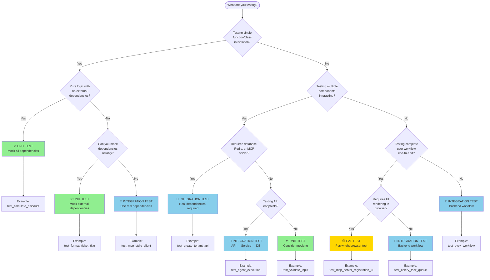

# Testing Decision Tree

**Version:** 1.0
**Last Updated:** 2025-11-11
**Purpose:** Visual flowchart guiding developers to choose the correct test type
**Related:** [Integration Testing Guide](integration-testing-guide.md) | [Test Examples Catalog](test-examples-catalog.md)

## Quick Reference Guide

Use this decision tree when you're writing a test and unsure whether to write a **Unit Test**, **Integration Test**, or **E2E Test**.

---

## Decision Flowchart



---

## Extended Decision Points

### Decision Point 1: External Dependencies Required?

**Question:** Does your test require external dependencies (database, Redis, MCP server, file system)?

| Answer | Test Type | Rationale |
|--------|-----------|-----------|
| **No** | ✅ Unit Test | Fast, isolated, deterministic |
| **Yes** | 🔵 Integration Test | Validates real integration, catches configuration issues |

**Example Scenarios:**

```python
# ❌ No external dependencies → UNIT TEST
def test_calculate_discount_unit():
    """Pure logic test, no external dependencies."""
    price = 100
    discount_percent = 20
    result = calculate_discount(price, discount_percent)
    assert result == 80

# ✅ External dependencies (database) → INTEGRATION TEST
@pytest.mark.integration
async def test_create_tenant_integration(async_db_session):
    """Requires real database connection."""
    tenant = Tenant(name="Test Corp")
    async_db_session.add(tenant)
    await async_db_session.commit()
    assert tenant.id is not None
```

---

### Decision Point 2: UI Rendering Required?

**Question:** Does your test require UI rendering in a browser (Streamlit pages, HTML, JavaScript)?

| Answer | Test Type | Rationale |
|--------|-----------|-----------|
| **No** | 🔵 Integration Test | API/backend testing sufficient |
| **Yes** | 🟡 E2E Test | Playwright validates UI interactions |

**Example Scenarios:**

```python
# ❌ No UI rendering → INTEGRATION TEST
@pytest.mark.integration
async def test_mcp_tool_discovery_api(async_client):
    """Backend API test, no UI."""
    response = await async_client.get("/api/mcp-servers/tools")
    assert response.status_code == 200

# ✅ UI rendering required → E2E TEST
@pytest.mark.e2e
async def test_mcp_tool_discovery_ui(admin_page):
    """Playwright test for UI interaction."""
    await admin_page.goto("http://localhost:8502/Agent_Management")
    await admin_page.get_by_role("tab", name="Tools").click()
    await expect(admin_page.get_by_text("Discover MCP Tools")).to_be_visible()
```

**Real-World Case Study (Epic 11, Story 11.2.5):**
- ❌ **Mistake:** Only wrote unit tests for UI helper functions
- ❌ **Result:** Unit tests passed ✅, but UI integration broken (2 CRITICAL bugs)
- ✅ **Fix (Story 12.5):** Added E2E Playwright test validating full UI workflow
- ✅ **Lesson:** UI stories require **both** unit tests AND E2E tests

---

### Decision Point 3: Time-Sensitive or Flaky?

**Question:** Is your test timing-sensitive or potentially flaky (async race conditions, external API timeouts)?

| Answer | Test Type | Rationale |
|--------|-----------|-----------|
| **Yes** | ✅ Unit Test | Mock for determinism, avoid flakiness |
| **No** | 🔵 Integration Test | Real dependencies safe |

**Example Scenarios:**

```python
# ❌ Flaky (async race condition) → UNIT TEST with mocks
@pytest.mark.unit
async def test_agent_execution_with_timeout_unit(mock_litellm_client):
    """Mock LiteLLM for deterministic test (no actual API call)."""
    mock_litellm_client.complete.return_value = {
        "content": "Mocked response",
        "usage": {"total_tokens": 50}
    }
    result = await execute_agent(agent_id="test", input="Hello")
    assert result["status"] == "success"

# ✅ Not flaky (database operations deterministic) → INTEGRATION TEST
@pytest.mark.integration
async def test_create_agent_integration(async_db_session):
    """Database operations deterministic, safe for integration test."""
    agent = Agent(name="Test Agent", system_prompt="Prompt")
    async_db_session.add(agent)
    await async_db_session.commit()
    assert agent.id is not None
```

**Real-World Case Study (Epic 12, Story 12.4):**
- 56 flaky tests resolved by fixing async race conditions
- Pattern: `time.sleep(5)` replaced with `await asyncio.wait_for()`
- Result: Test reliability improved from 84.6% → 89.6%

---

### Decision Point 4: Critical Production Workflow?

**Question:** Is this testing a critical production workflow (user signup, payment, data deletion)?

| Answer | Test Type | Rationale |
|--------|-----------|-----------|
| **Yes** | 🔵 Integration Test **+** 🟡 E2E Test | Redundant coverage for critical paths |
| **No** | 🔵 Integration Test **or** 🟡 E2E Test | Single test type sufficient |

**Example Scenarios:**

```python
# ✅ Critical workflow → BOTH integration + E2E tests

# Integration test (backend workflow)
@pytest.mark.integration
async def test_byok_workflow_integration(async_client):
    """Integration test: BYOK workflow (API level)."""
    # Create tenant → Add provider → Verify key
    tenant_response = await async_client.post("/api/tenants", json={"name": "Corp"})
    tenant_id = tenant_response.json()["id"]

    provider_response = await async_client.post(
        f"/api/tenants/{tenant_id}/providers",
        json={"provider_name": "openai", "api_key": "sk-test"}
    )
    assert provider_response.status_code == 201

# E2E test (UI workflow)
@pytest.mark.e2e
async def test_byok_workflow_e2e(admin_page):
    """E2E test: BYOK workflow (UI level)."""
    await admin_page.goto("http://localhost:8502/Tenants")
    await admin_page.get_by_role("button", name="Add Provider").click()
    await admin_page.fill("input[name='api_key']", "sk-test-key")
    await admin_page.get_by_role("button", name="Save").click()
    await expect(admin_page.get_by_text("Provider added successfully")).to_be_visible()
```

**Recommendation:** Critical workflows deserve redundant test coverage at multiple levels.

---

### Decision Point 5: Tenant Context Required?

**Question:** Does your test require multi-tenant context (RLS policies, tenant isolation)?

| Answer | Test Type | Fixture |
|--------|-----------|---------|
| **Yes** | 🔵 Integration Test | Use `test_tenant` fixture |
| **No** | ✅ Unit Test or 🔵 Integration Test | No tenant fixture needed |

**Example Scenarios:**

```python
# ✅ Tenant context required → Use test_tenant fixture
@pytest.mark.integration
async def test_agent_tenant_isolation(async_db_session, test_tenant):
    """Test RLS enforces tenant isolation."""
    # Set tenant context
    await async_db_session.execute(
        text("SELECT set_tenant_context(:tenant_id)"),
        {"tenant_id": str(test_tenant.id)}
    )

    # Query agents (should only return test_tenant's agents)
    result = await async_db_session.execute(select(Agent))
    agents = result.scalars().all()

    # Verify tenant isolation
    for agent in agents:
        assert agent.tenant_id == test_tenant.id
```

---

### Decision Point 6: MCP Server Required?

**Question:** Does your test require an MCP server (stdio transport, tool invocation)?

| Answer | Test Type | Marker | Notes |
|--------|-----------|--------|-------|
| **Yes** | 🔵 Integration Test | `@pytest.mark.requires_mcp_server` | Skip if npx unavailable |
| **No** | ✅ Unit Test or 🔵 Integration Test | No marker | Normal test |

**Example Scenarios:**

```python
# ✅ MCP server required → Use skip marker
@pytest.mark.integration
@pytest.mark.requires_mcp_server
async def test_mcp_stdio_tool_invocation(mcp_stdio_client):
    """Test requires official MCP test server (npx @modelcontextprotocol/server-everything)."""
    tools = await mcp_stdio_client.list_tools()
    assert len(tools) > 0

    result = await mcp_stdio_client.call_tool("echo", {"message": "Hello"})
    assert result["content"] == "Hello"
```

**Setup Instructions:**

```bash
# Install official MCP test server (Node.js required)
npm install -g @modelcontextprotocol/server-everything

# Verify installation
npx @modelcontextprotocol/server-everything --help

# Run tests requiring MCP server
pytest -m requires_mcp_server
```

---

## Test Type Comparison Table

| Criterion | Unit Tests | Integration Tests | E2E Tests |
|-----------|-----------|------------------|-----------|
| **Speed** | ⚡ Very Fast (10-100ms) | 🏃 Moderate (1-5s) | 🐌 Slow (10-60s) |
| **Reliability** | 🟢 Very Reliable (99%+) | 🟢 Reliable (95%+) | 🟡 Can Be Flaky (85-95%) |
| **Coverage** | 🔍 Low-Level Logic | 🔗 Component Integration | 🌐 Complete User Journeys |
| **Maintenance Cost** | 💚 Low | 💛 Moderate | ❤️ High |
| **Debugging Ease** | ✅ Easy (single function) | 🔶 Moderate (multiple components) | ❌ Hard (full stack + UI) |
| **Dependencies** | None (all mocked) | Real (DB, Redis, MCP) | Real (full stack + browser) |
| **Execution Environment** | In-memory | Docker services | Docker + Streamlit + Browser |
| **Typical Count (70/20/10)** | ~1,730 tests | ~500 tests | ~243 tests |

**Project Status (Story 12.9):**
- ✅ Unit Tests: 70% (1,730 tests, 93.93% pass rate)
- ✅ Integration Tests: 20% (500 tests, 89.6% pass rate)
- ✅ E2E Tests: 10% (243 tests, 3 critical workflows)

---

## When to Write Each Test Type

### Write Unit Tests When:

1. ✅ **Pure Logic:** Algorithms, calculations, string manipulation
2. ✅ **Input Validation:** Pydantic models, custom validators
3. ✅ **Business Rules:** Discount calculations, eligibility checks
4. ✅ **Utility Functions:** Date formatting, data transformation
5. ✅ **Error Handling:** Exception paths, edge cases

**Example:**
```python
@pytest.mark.unit
def test_calculate_budget_remaining():
    """Pure logic, no external dependencies."""
    budget = 1000
    spent = 350
    assert calculate_budget_remaining(budget, spent) == 650
```

### Write Integration Tests When:

1. 🔵 **API Endpoints:** FastAPI routes → services → database
2. 🔵 **Database Operations:** Complex queries, transactions, RLS
3. 🔵 **External Services:** Redis queues, MCP servers (real)
4. 🔵 **Multi-Component Workflows:** Agent execution, plugin registration
5. 🔵 **Configuration Validation:** Environment variables, feature flags

**Example:**
```python
@pytest.mark.integration
async def test_create_agent_api(async_client):
    """API endpoint → service → database workflow."""
    response = await async_client.post("/api/agents", json={"name": "Agent"})
    assert response.status_code == 201
```

### Write E2E Tests When:

1. 🟡 **UI Workflows:** Streamlit pages, browser interactions
2. 🟡 **Critical User Journeys:** Signup, payment, data export
3. 🟡 **Cross-Component Integration:** UI → API → Database → External Service
4. 🟡 **Regression Prevention:** Bugs that unit/integration tests missed

**Example:**
```python
@pytest.mark.e2e
async def test_agent_creation_ui(admin_page):
    """Full UI workflow with browser automation."""
    await admin_page.goto("http://localhost:8502/Agent_Management")
    await admin_page.get_by_role("button", name="Create Agent").click()
    await admin_page.fill("input[name='name']", "New Agent")
    await admin_page.get_by_role("button", name="Save").click()
    await expect(admin_page.get_by_text("Agent created")).to_be_visible()
```

---

## Real-World Case Studies

### Case Study 1: Story 11.2.5 (MCP Tool Discovery UI)

**Scenario:** Implementing MCP tool discovery UI in Agent Management page

**Initial Approach:**
- ❌ Only wrote unit tests with mocked Streamlit functions
- ❌ Unit tests passed ✅ (100% pass rate)

**Result:**
- 🐛 CRITICAL Bug #1: `st.pills()` call never tested, broke in production
- 🐛 CRITICAL Bug #2: UI helper not integrated, discovery button missing

**Root Cause:**
- Unit tests validated helper function logic
- Unit tests did NOT validate UI integration

**Fix (Story 12.5):**
- ✅ Added E2E Playwright test verifying full UI workflow
- ✅ Test navigates to page, clicks tab, verifies UI renders

**Lesson Learned:**
> **UI stories require BOTH unit tests AND E2E tests**
> - Unit tests: Validate helper logic
> - E2E tests: Validate UI integration

**Decision Tree Application:**
```
Q: Testing UI rendering? → YES
→ 🟡 E2E Test Required

Q: Also testing helper functions? → YES
→ ✅ Unit Tests ALSO Required

Result: BOTH test types needed for UI stories
```

---

### Case Study 2: Story 12.3 (Mock Refactoring)

**Scenario:** 115 tests over-mocking dependencies

**Problem:**
- ❌ Integration tests mocking database → Glorified unit tests
- ❌ Tests passed but missed SQL errors, schema issues, RLS violations

**Example Anti-Pattern:**
```python
# ❌ BAD: Integration test over-mocking
@pytest.mark.integration
async def test_create_tenant_over_mocked(mock_db_session):
    """Integration test mocking database defeats the purpose."""
    mock_db_session.add = Mock()
    mock_db_session.commit = AsyncMock()

    service = TenantService(mock_db_session)
    await service.create_tenant(name="Test")

    mock_db_session.add.assert_called_once()
    # ❌ Doesn't test SQL, schema, constraints, RLS
```

**Fix (Story 12.3):**
```python
# ✅ GOOD: Integration test with real database
@pytest.mark.integration
async def test_create_tenant_real_db(async_db_session):
    """Integration test with real database."""
    service = TenantService(async_db_session)
    tenant = await service.create_tenant(name="Test")

    # ✅ Tests SQL, schema, constraints, RLS
    assert tenant.id is not None  # DB-generated UUID
    assert tenant.created_at is not None  # DB timestamp
```

**Result:**
- ✅ 115 tests fixed (over-mocking removed)
- ✅ Pass rate improved to 93.93%
- ✅ Real integration bugs caught

**Lesson Learned:**
> **Integration tests should use REAL dependencies (DB, Redis)**
> - Mock only external paid APIs (LiteLLM, OpenRouter)
> - Use real dependencies for internal services

**Decision Tree Application:**
```
Q: Testing database operations? → YES
→ 🔵 Integration Test with REAL database

Q: Should I mock the database? → NO
→ Use async_db_session fixture (real postgres)
```

---

### Case Study 3: Story 12.4 (Flaky Tests)

**Scenario:** 56 flaky tests with async race conditions

**Problem:**
- ❌ Tests using `time.sleep(5)` to wait for async operations
- ❌ Tests passing locally, failing in CI (timing issues)

**Example Anti-Pattern:**
```python
# ❌ BAD: Flaky test with time.sleep
import time

@pytest.mark.integration
async def test_celery_task_flaky():
    task = enhance_ticket.delay(ticket_id=123)
    time.sleep(5)  # ❌ Arbitrary wait
    result = task.get(timeout=1)
    assert result["status"] == "success"
```

**Fix (Story 12.4):**
```python
# ✅ GOOD: Reliable test with proper async patterns
import asyncio

@pytest.mark.integration
async def test_celery_task_reliable():
    task = enhance_ticket.delay(ticket_id=123)

    # ✅ Wait with timeout and retry
    result = await asyncio.wait_for(
        task.get_async(),
        timeout=30
    )
    assert result["status"] == "success"
```

**Result:**
- ✅ 56 flaky tests fixed
- ✅ Pass rate improved from 84.6% → 89.6%
- ✅ CI reliability improved

**Lesson Learned:**
> **Avoid `time.sleep()` in tests, use proper async patterns**
> - Use `await asyncio.wait_for()` with timeout
> - Use deterministic mocks for external APIs
> - Use `await` for all async operations

**Decision Tree Application:**
```
Q: Is test timing-sensitive? → YES
→ ✅ Unit Test with mocks (deterministic)

Q: Can't mock (testing async workflow)? → YES
→ 🔵 Integration Test with proper async patterns (no time.sleep!)
```

---

## Quick Decision Matrix

| What You're Testing | Unit | Integration | E2E | Rationale |
|---------------------|------|-------------|-----|-----------|
| Pure function (no I/O) | ✅ | ❌ | ❌ | Fast, isolated |
| Database query | ❌ | ✅ | ❌ | Need real DB |
| API endpoint | ❌ | ✅ | ❌ | API → DB integration |
| Celery task | ❌ | ✅ | ❌ | Need real Redis |
| MCP tool invocation | ❌ | ✅ | ❌ | Need real MCP server |
| Streamlit UI page | ❌ | ❌ | ✅ | Need browser |
| LiteLLM API call | ✅ | ❌ | ❌ | Mock (paid service) |
| BYOK workflow | ❌ | ✅ | ✅ | Both (critical workflow) |
| Agent execution | ❌ | ✅ | ❌ | Multi-component, backend |
| User signup flow | ❌ | ✅ | ✅ | Both (critical + UI) |

---

## Recommended Test Distribution

**Target (Test Pyramid):**
- 70% Unit Tests
- 20% Integration Tests
- 10% E2E Tests

**Our Project Status:**
```
Total Tests: 2,473
├── Unit Tests: ~1,730 (70%) ✅
├── Integration Tests: ~500 (20%) ✅
└── E2E Tests: ~243 (10%) ✅
```

**Analysis:** ✅ Project follows ideal test pyramid distribution

---

## Summary: When in Doubt

1. **Ask: "Am I testing multiple components together?"**
   - No → Unit Test
   - Yes → Integration Test

2. **Ask: "Does it require a browser?"**
   - Yes → E2E Test
   - No → Integration Test

3. **Ask: "Is it pure logic with no I/O?"**
   - Yes → Unit Test
   - No → Consider Integration Test

4. **Ask: "Is it a critical user workflow?"**
   - Yes → Both Integration + E2E
   - No → Integration Test sufficient

**Still Unsure?** Default to **Integration Test** (most common for backend APIs).

---

**See Also:**
- [Integration Testing Guide](integration-testing-guide.md) - Comprehensive guide
- [Test Examples Catalog](test-examples-catalog.md) - 13 real test examples
- [Test Fixture Library](test-fixture-library.md) - Fixture catalog

---

**Document Version:** 1.0
**Last Updated:** 2025-11-11
**Maintained By:** Engineering Team
